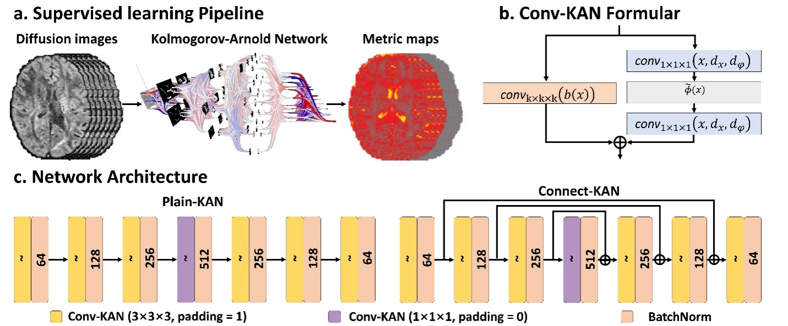
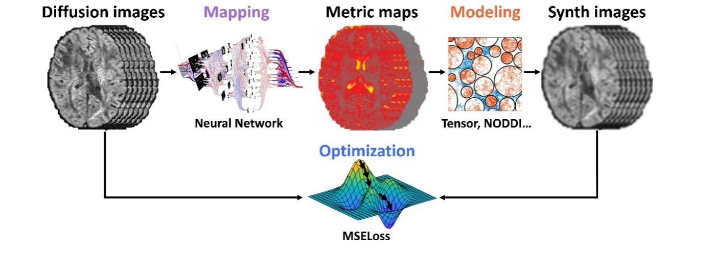

# MicroKAN

### Supervised learning architecture:

(a) Overview of the supervised learning pipeline illustrates the workflow from diffusion-weighted MRI images to microstructural metric maps. (b) Mathematical formulation of the Conv-KAN operation, detailing the nonlinear convolutional mechanism based on spline activations. (c) Detailed depiction of the network architecture, contrasting the Plain-KAN structure for comparison with the Connect-KAN architecture, which incorporates skip connections to effectively enhance feature propagation and preserve spatial information without the use of pooling operations.

#### Self-Supervised learning architecture:

The self-supervised learning framework DIMOND-KAN extends the Connect-KAN architecture to settings without external data and reference data for training. The model leverages inherent diffusion MRI signal relationships, avoiding explicit reliance on reference microstructural property maps and facilitating accurate microstructure estimation through self-supervision.


## 1. Requirements
Clone this repository and navigate to it in your terminal. Then run:
```
pip install -r requirements.txt
```

## 2. Data Preparation
### **(1) Data source:**
Pre-processed diffusion MRI data from the Human Connectome Project (HCP) WU-Minn-Ox Consortium public database (https://www.humanconnectome.org) were utilized in this study.

### **(2) Tips for DWI pre-processing:**
- Follow the conventional DWI pre-processing pipeline (e.g., [HCP](https://www.humanconnectome.org), [MGH-CDMD](https://doi.org/10.1038/s41597-021-01092-6)).

- Conduct DWI bias correct using the **[dwibiascorrect](https://mrtrix.readthedocs.io/en/dev/reference/commands/dwibiascorrect.html)** function of MRtrix. Recommend to use MRtrix's **[docker image](https://mrtrix.readthedocs.io/en/dev/installation/using_containers.html)**.
```
# Note that the bias map of a single channel is directly multiplied onto each channel of the image,
# effectively scaling each channel uniformly without altering the diffusion model parameters. 

dwibiascorrect ants mwu100307_diff.nii.gz mwu100307_diff_biascorrect.nii.gz -fslgrad mwu100307_diff.bvec mwu100307_diff.bval -mask mwu100307_diff_mask.nii.gz -bias mwu100307_diff_bias.nii.gz
```

## 3. Training
- To train our model (DTI) in the paper, run this command:
```
python train_dti.py
```

- To train our model (NODDI) in the paper, run this command:
```
python train_noddi.py
```

## 4. Evaluation
- To evaluate our model (DTI) in the paper, run this command:
```
python test_dti.py
```

- To evaluate our model (NODDI) in the paper, run this command:
```
python test_noddi.py
```

## 5. Metric Calculation
- To calculate the DTI metric, run this command:
```
python pydti_dti.py
```

- To calculate the NODDI metric, run this command:
```
python pydti_noddi.py
```

## 6. References
- Our Supervised learning architecture codebase is modified based on [DeepDTI](https://github.com/qiyuantian/DeepDTI).

- Our Self-Supervised learning architecture codebase is modified based on [DIMOND](https://github.com/Lthinker/DIMOND).

## 7. Citation
```

```
